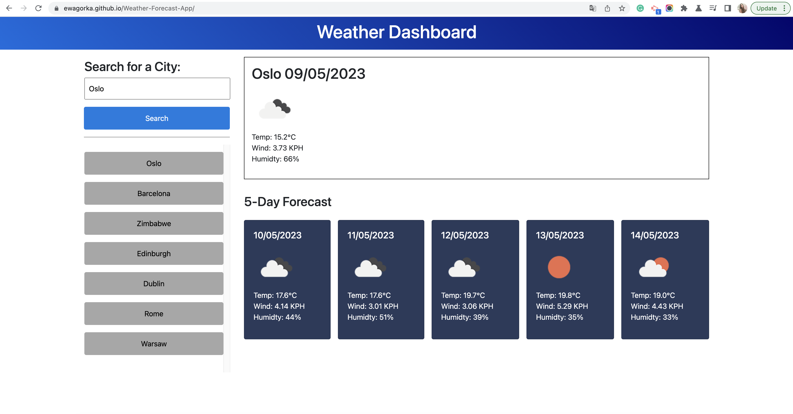

# Weather-Forecast-App
A weather forecast app - challenge 8 of the Frontend Development Bootcamp

## Project Description
For this week's project, we were asked create a weather forcast app using OpenWeather API.

The App should allow the user to enter a city name & display the weather forecast for today and the next 5 days.

The criteria for the app were:
* Create a weather dashboard with form inputs.
  * When a user searches for a city they are presented with current and future conditions for that city and that city is added to the search history
  * When a user views the current weather conditions for that city they are presented with:
    * The city name
    * The date
    * An icon representation of weather conditions
    * The temperature
    * The humidity
    * The wind speed
  * When a user view future weather conditions for that city they are presented with a 5-day forecast that displays:
    * The date
    * An icon representation of weather conditions
    * The temperature
    * The humidity
  * When a user click on a city in the search history they are again presented with current and future conditions for that city

## My Approach

As usual, I started by reading the user story, and acceptance criteria and studying the given starter code.

Then I divided my work into 3 main chunks:
1. Create necessary HTML elements and add styles, so it resembles the mockup image.
2. Connect to the Open Weather API & display data.
3. Add saving previous search functionality with the use of local storage.

First main task I managed to complete quite easily, but it took a lot more time than expected. I had to add a lot of !important to my own styles to override Bootstrap presets.

The second task I found a bit more challenging, but because I got to work with different APIs during classes in the past week, I managed to connect with the Open Weather API quickly. 

There were a couple of things with this step that I wasn't very sure about, but the app works fine in the end:
* I used the Built-in API request by city name to get info about the weather in the given city, rather than converting & passing the geographical coordinates 
* For the next 5 days' weather forecast, I wasn't sure what data I should present as the API gives weather data for each day for every 3 hours - so, in the end, I chose to present the weather conditions that match the 15:00:00 time

The third task I had no bigger issues with, as I got to work with saving data in the local storage quite a bit in the past challenge. The one thing that I added that wasn't specified in the project was a scrollable search history area. I thought that this will be more user-friendly than if the history buttons formed a very long list that will expand the whole page if the user searches for 10+ cities.

Overall I'm quite satisfied with the final outcome of this project & really enjoyed working on it.

## Credits
I have used the following page: https://stackoverflow.com/questions/21437163/loop-through-array-of-objects-to-find-object-with-matching-property to see how I can use the find function and use it to search for results from my query response.

I used this video: https://www.google.com/search?q=catch+api+error&sxsrf=APwXEdez3At2_fqwfvo0gOrz4SVg3O-sWw:1683653010507&source=lnms&tbm=vid&sa=X&ved=2ahUKEwj22_ac4Oj-AhWF6CoKHWwpBUMQ_AUoAXoECAEQAw&biw=1744&bih=877&dpr=2#fpstate=ive&vld=cid:3e30fedd,vid:9YyHwmrkztE to learn how to catch API errors.

## Technologies
This project was made using HTML, CSS ,and Javascript.

## Deployed Website
The deployed website: https://ewagorka.github.io/Weather-Forecast-App/

## Deployed Website Screenshot and GIF

## License
Please refer to the LICENSE in the repo.